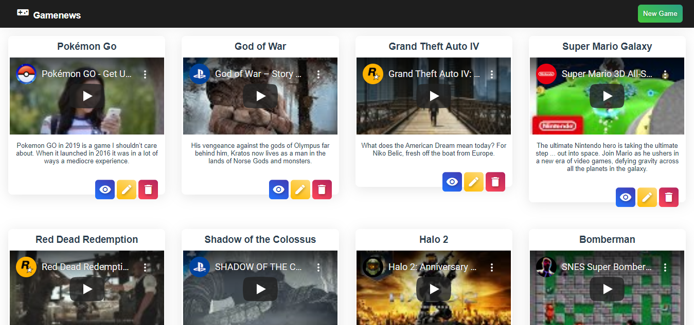
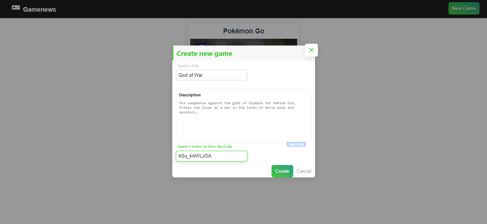
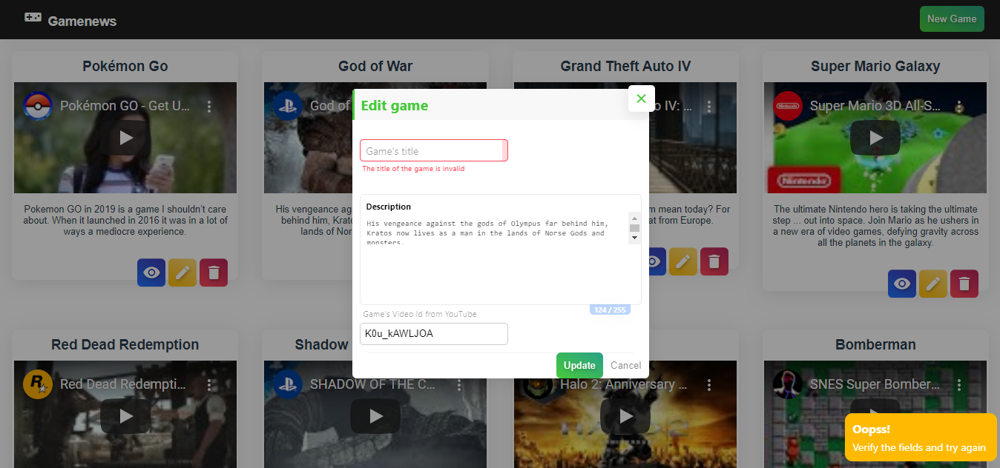

<h5 align="center">
   <br/>
  <b>Gamenews</b> :yo_yo:
</h5>
<p align="center">
  
</p>

## :eyes: Overview 
<div>
 
 
 
</div>

## :open_book: About 
This project is a simple aggregator of brief descriptions about games. You can register and edit games (and their videos on YouTube), view and delete them too.<br />
<br /><br />

This project was developed in [SatellaSoft's Course - PHP - CRIANDO E CONSUMINDO API RESTFUL](https://academy.satellasoft.com/course/v/php-criando-e-consumindo-api-restful).
<br /><br /><br /><br />

## :rosette: API Routes
```php
$router->get('/', 'GameController@index');
$router->get('/{id}', 'GameController@getById');
$router->post('/', 'GameController@create');
$router->put('/{id}', 'GameController@update');
$router->delete('/{id}', 'GameController@delete');
```

## :running_man: API - Installing and Running
 1. Clone this repository ```https://github.com/pferreirafabricio/gamenews.git```;
 2. Enter in the project's folder: ```cd gamenews```
 2. Enter in the API's folder: ```cd backend```
 3. Generate the autoload files: ```composer update```
 6. Finally run the apache server and access ```http://localhost/gamenews/backend/game``` 😃
 > OBS: If your url is different, change the CONF_BASE_URL constant in ```source/Boot/Config.php```
 
## 	:running_woman: Front End - Installing and Running
 1. Clone this repository ```https://github.com/pferreirafabricio/gamenews.git```;
 2. Enter in the project's folder: ```cd gamenews```
 2. Enter in the FrontEnd's folder: ```cd frontend```
 3. Install all dependencies: ```npm install```
 6. Run the server: ```npm run serve```
 7. Access in your browser: ```http://localhost:8080``` 😃

## :bricks: This project was built with: 
- [PHP](https://www.php.net)
- [CoffeeCode Router](https://github.com/robsonvleite/router)
- [MySQL](https://www.mysql.com)
- [Vue](https://vuejs.org/)
- [Vuesax](https://lusaxweb.github.io/vuesax/)

## :recycle: Contribute
 1. Fork this repository;
 2. Create a branch with your feature: ```git checkout -b my-feature```
 3. Commit your changes: ```git commit -m 'feat: My new feature'```
 4. Push your branch: ```git push origin my-feature```
 
## :page_with_curl:	License
This project is under the MIT license. Take a look at the [LICENSE](LICENSE.md) file for more details.
